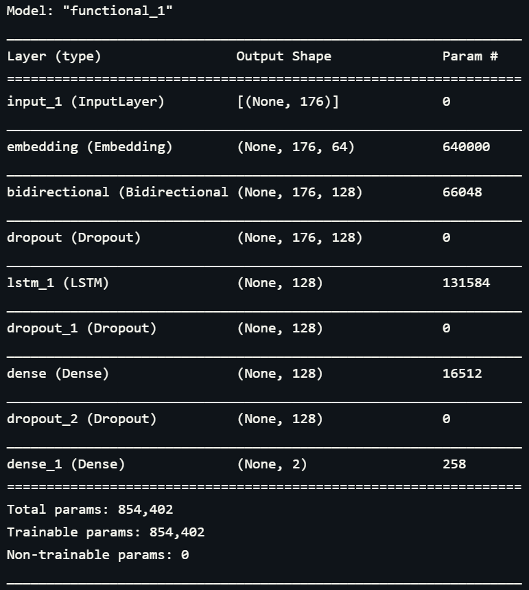
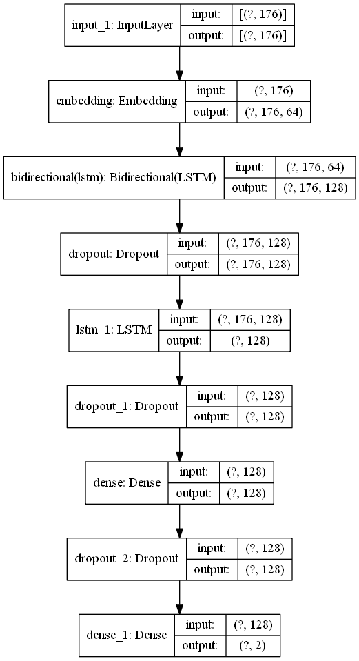
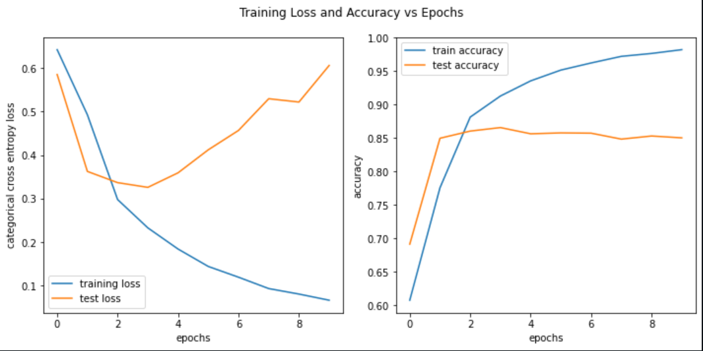
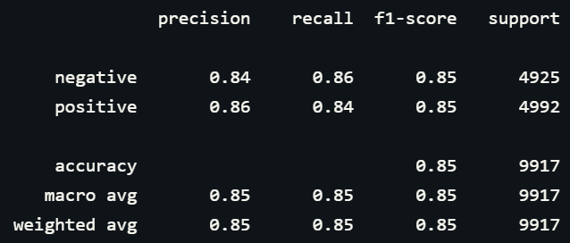
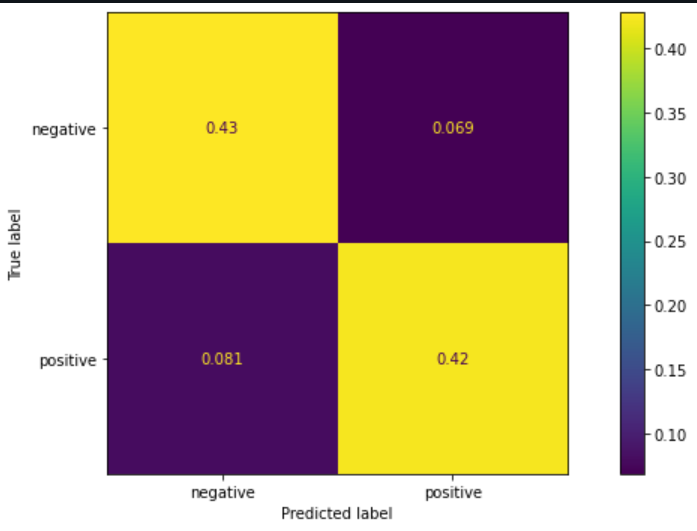

# Project: Movie Reviews Sentiment Analysis

# Description
The project is about developing a NLP deep learning model to classify the sentiment of a movie review whether it have a positive or a negative sentiment. The main component of the deep learning model is the well-knownn Long Short-Term Memory (LSTM) layer including the utilization of (word) Embedding layer. The deep learning model are trained on 50,000+ movie reviews. Each of the review are labelled with either a 'Positive' or 'Negative' sentiment.

# How to Install and Run the Project
To run and train the model on your own device, clone the whole repository. Then, proceed to the directory containing the cloned repository. In this particular directory, locate the `sentiment_deploy.py` file and run this file in your terminal or any of your favorite IDEs. This will generate all the relevant plots and results especially the trained NLP deep learning model.

# Results
## Model Summary

## Neural Network Model Plot

## Training/Test Loss and Metric (Accuracy)

## Model Performance on The Test Dataset
### Classification Report

### Confusion Matrix

# Credits
- [Markdown badges source 1](https://github.com/Ileriayo/markdown-badges)
- [Markdown badges source 2](https://github.com/alexandresanlim/Badges4-README.md-Profile)
